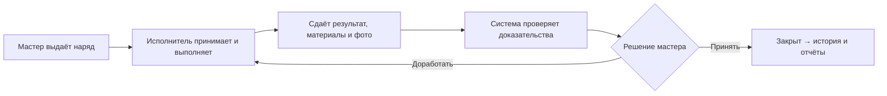
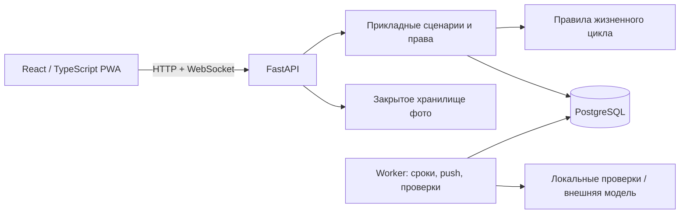

<div align="center">


# ТехНаряд

### От задания мастера до принятого ремонта — в одном приложении

**Мобильная PWA · Проверка ремонта · Контроль сроков · Производственная аналитика**

Проект команды **McLOVINs** для кейса №1 АО «Костанайские минералы»<br>
**QOSTANAI AI INDUSTRY HACKATHON 2026**

[Открыть приложение](https://technaryad.online/) · [Презентация](docs/submission/technaryad-pitch.pdf) · [Видео](docs/submission/technaryad-demo.webm) · [Матрица требований](docs/requirements.md)

</div>

---

**ТехНаряд помогает мастеру назначить ремонт, исполнителю — выполнить его и отчитаться с телефона, руководителю — увидеть задержки, расход материалов и повторные проблемы.** Задание, фотографии, проверки и решения сохраняются в одной истории. ИИ даёт объяснимую рекомендацию; окончательную приёмку выполняет мастер.

> **Начать за несколько минут:** для знакомства выберите [единый локальный запуск](#local-run). Для уже настроенного публичного приложения используйте [запуск на домене](#domain-run). Данные для показа загружаются [отдельным сидом](#данные-для-показа-сид).

## Содержание

Интерфейс доступен на русском, казахском и английском. Выбор языка расположен на
экране входа, в меню приложения и в диалогах. Он сохраняется на устройстве и не
перезагружает страницу: введённые поля и текущая сессия остаются на месте.
Названия оборудования, описания нарядов, комментарии, сохранённые результаты ИИ
и серверные документы сохраняют исходный язык; перевод интерфейса их не изменяет.
Форма подбора и стандартные объяснения рекомендаций также переключаются между
тремя языками без повторного запроса. Значения из справочников остаются исходными.
Текстовый подбор распознаёт распространённые русские, казахские и английские
термины из ограниченного словаря; произвольный текст не переводится моделью.


- [Что умеет приложение](#что-умеет-приложение)
- [Роли и порядок работы](#роли-и-порядок-работы)
- [Подсказки при выдаче](#подсказки-при-выдаче-наряда)
- [QR-коды оборудования](#qr-коды-оборудования)
- [Какой вариант запуска выбрать](#какой-вариант-запуска-выбрать)
- [1. Локальный запуск](#local-run)
- [2. Docker локально](#docker-local)
- [3. Телефон через временную HTTPS-ссылку](#phone-run)
- [4. Постоянный домен](#domain-run)
- [Данные и учётные записи](#данные-для-показа-сид)
- [ИИ и push-уведомления](#настройка-ии-и-уведомлений)
- [Разработка и диагностика](#разработка-и-диагностика)
- [Архитектура и проверки](#архитектура-и-проверки)
- [Демонстрация жюри и подготовка к защите](#демонстрация-жюри-и-подготовка-к-защите)

## Что умеет приложение

| Задача | Что реализовано |
| --- | --- |
| Назначить работу | Плановый/внеплановый наряд: участок, оборудование, исполнитель, срок, четыре приоритета и фото до ремонта |
| Получить подсказку при выдаче | Подходящие шифры по описанию, норматив для выбранного типа оборудования и исполнители с объяснением специальности, смены, загрузки и истории качества; выбор подтверждает мастер |
| Открыть машину по QR | Карточка оборудования после входа; мастер выдаёт наряд с заполненными участком и машиной, рабочий переходит к своим заданиям; QR можно сохранить и распечатать |
| Управлять сменой | Загрузка исполнителей, очередь, отказ с причиной, переназначение, отмена и смена приоритета |
| Выполнить ремонт | Принятие, начало, пауза с причиной, продолжение, описание результата, шифр неисправности, материалы и фото после |
| Проверить результат | Локальные проверки доказательств, внешняя текстовая/визуальная проверка при настройке, замечания и решение мастера |
| Контролировать сроки | Просрочки, напоминания, аварийные уведомления, подтверждение получения и эскалация |
| Работать с телефона | Установка PWA, адаптивный интерфейс, сжатие фото, ручное скрытие чувствительных областей, офлайн-очередь действий |
| Видеть изменения | WebSocket обновляет доступные данные между устройствами; личный журнал и Web Push |
| Анализировать работу | Периоды и фильтры, результаты сотрудников/бригад, материалы, повторные работы, фактический простой, сигналы и Excel-отчёты |
| Поддерживать данные | Сотрудники, участки, оборудование, бригады, материалы, шифры и нормативы; защищённая история связанных записей |

В нарядах две вкладки: **«В работе»** — все незакрытые задания, **«История»** — закрытые и отменённые. История у мастера, руководителя и исполнителя отображается сеткой карточек, по **24 наряда на страницу**; на телефоне карточки располагаются в один ряд по ширине экрана. Номера страниц и кнопки «Назад»/«Далее» позволяют пройти всю историю.

Мастер по умолчанию видит свои наряды; фильтр позволяет выбрать другого доступного мастера или всех. Исполнитель видит только свои задания и может отобрать их по выдавшему мастеру. **Сортировка** применяется ко всей выборке до разбивки на страницы: по важности, ближайшему сроку, сначала новые или сначала старые. При изменении фильтра или сортировки список открывается с первой страницы; условия сохраняются в ссылке и после перезагрузки.

Нажатие на имя рабочего в справочнике или загрузке открывает его текущие задания. Нажатие на **своё имя рядом с выходом** возвращает мастера к выданным им текущим нарядам, а исполнителя — ко всем своим текущим заданиям, сбрасывая предыдущие фильтры. При обычном переключении между работой и историей фильтры сохраняются.

## Роли и порядок работы

| Роль | Ответственность |
| --- | --- |
| **Исполнитель** | Свои назначения, выполнение, сдача, замечания и личные результаты |
| **Мастер** | Выдача и управление собственными нарядами, загрузка участков, проверка и приёмка ремонта |
| **Руководитель** | Просмотр работы и аналитики доступных участков; без изменения нарядов |
| **Администратор** | Учётные записи, роли, участки и справочники; без производственной приёмки |

Права проверяет сервер, включая прямые запросы к API. Другой мастер может просматривать наряды доступного участка, но управление остаётся у выдавшего наряд мастера. Исполнитель получает только разрешённые ему сведения.



**«Сдан» ещё не означает «принят».** После сдачи наряд ожидает проверки и решения. При доработке исполнитель начинает новую попытку, а предыдущая сдача остаётся в истории. Сбой внешней модели не превращается в успешную проверку.

**Простой оборудования учитывается отдельно.** Мастер записывает фактический интервал остановки оборудования и причину. Пауза исполнителя и время существования наряда сами по себе не доказывают простой машины.

## Подсказки при выдаче наряда

Основной путь выдачи: **«Выдать наряд» → карточка оборудования → описание → карточка исполнителя → срок → «Выдать»**. Участок определяется по оборудованию; тип работ и приоритет показаны явно. Расширенные поля доступны в «Дополнительных параметрах». [Методика подсчёта шести нажатий и проверка на телефоне](docs/quick-issuance.md).

1. Выберите оборудование и опишите неисправность обычными словами.
2. Подбор запускается автоматически после ввода описания: система предложит до трёх шифров из справочника и объяснит совпадение. В дополнительных параметрах подтвердите подходящий шифр или выберите его вручную.
3. Для подтверждённого шифра показывается норматив **именно для типа выбранного оборудования**. Если такой записи нет, система не подставляет норматив другой машины. Норматив — трудозатраты по справочнику; срок выполнения задаётся отдельно.
4. Сравните автоматически предложенных исполнителей. Среди активных сотрудников участка на смене система учитывает специальность выбранного шифра, текущую работу, очередь и паузы. История качества учитывается для того же типа оборудования за последние 180 дней в доступных мастеру участках.
5. Сравните причины и подтвердите исполнителя. Подсказка не назначает человека автоматически и не заменяет проверку допуска мастером. Справочники и ручная выдача доступны и без подсказок.

История качества относится к **автору сдачи закрытого наряда**, даже если позднее исполнителя переназначили. Используется оценка мастера, а при её отсутствии — оценка автоматической проверки. Для отображения среднего и сравнения по качеству нужны минимум три оценённые сдачи; при меньшей выборке показывается её размер, без выдуманного рейтинга. При одинаковой нагрузке качество определяет порядок, только если у всех сравниваемых кандидатов достаточно истории; иначе используется нейтральный порядок по имени и выводится пояснение.

Подбор работает локально по справочникам, состоянию нарядов и истории: API-ключ внешней модели для него не нужен. Неизвестное описание, отсутствие подходящей специальности или норматива дают понятное сообщение, а не случайный результат. Предложения не являются диагностикой неисправности или подтверждением квалификационного допуска.

## QR-коды оборудования

1. Откройте приложение на постоянном адресе, например [technaryad.online](https://technaryad.online/), под мастером или администратором.
2. В **«Справочники → Оборудование»** откройте QR выбранной машины. Сверьте её инвентарный номер и участок, сохраните код или распечатайте наклейку.
3. Наведите обычную камеру телефона на QR и откройте распознанную ссылку. Если сессии ещё нет, войдите: приложение сохранит адрес оборудования.
4. **Мастер** нажимает «Выдать наряд» и получает форму с готовыми участком и машиной. **Исполнитель** открывает свои наряды этой машины, **руководитель** — доступные ему наряды. **Администратор** работает с карточкой и QR без производственной выдачи.

QR содержит только адрес карточки и идентификатор машины. Он не выдаёт доступ к закрытым участкам и не содержит пароль или токен. Архивное оборудование остаётся доступно для просмотра, но новые наряды на него не выдаются.

**Для постоянных наклеек нужен постоянный адрес.** QR с `localhost` ведёт на само устройство и для другого телефона не подходит; адрес локальной сети доступен только в соответствующей сети. Временная ссылка `trycloudflare.com` перестаёт подходить после смены туннеля. Генерируйте наклейки на том домене, которым будут пользоваться сотрудники. Не обрезайте белое поле вокруг QR; перед массовой печатью проверьте одну наклейку камерой реального телефона.

## Какой вариант запуска выбрать

Все команды выполняются **из корня репозитория**. Для Windows используйте терминал **Ubuntu/WSL**; нативные команды ниже также рассчитаны на Linux/macOS. Не смешивайте Windows Python и WSL-окружение.

**На новом ноутбуке создайте окружение заново.** Не копируйте `.venv`, `node_modules` и `var/postgres/data` между ОС или архитектурами. Установите зависимости по lock-файлам; существующие данные переносите через резервную копию. `.env`, `.env.docker`, ключи ИИ, VAPID и постоянного туннеля не приходят с `git pull` — их настраивают отдельно. Для одинакового набора серверных зависимостей используйте Docker с Linux-контейнерами.

Проверенные сценарии и ограничения платформ: [результаты проверки запуска](docs/startup-verification.md). Проверка на WSL не означает физическую проверку каждого Mac или ноутбука.

| Вариант | Адрес | Какие данные использует | Для чего |
| --- | --- | --- | --- |
| Единый локальный запуск | `http://127.0.0.1:5173` | Нативная проектная PostgreSQL | Знакомство, репетиция, локальная PWA |
| Раздельный запуск | `http://127.0.0.1:5173` | Та же нативная PostgreSQL | Разработка с горячим обновлением |
| Docker локально | `http://127.0.0.1:8080` | Отдельная PostgreSQL в Docker volume | Воспроизводимое развёртывание |
| Временный туннель | Напечатанный `https://…trycloudflare.com` | Та же база, что у нативного локального запуска | Проба на телефоне без постоянного домена |
| Постоянный туннель | [technaryad.online](https://technaryad.online/) | База Docker-развёртывания | Публичная демонстрация и установленная PWA |

**Запуск локального Python/API не включает сайт на домене.** Домен обслуживается Docker-приложением и постоянным туннелем. Нативная и Docker-базы независимы: сид, пароль и изменения в одной не появляются автоматически в другой. Два пользователя одного адреса работают с общей базой этого развёртывания.

<a id="local-run"></a>

## 1. Локальный запуск — рекомендуемый вариант

Нужны **uv**, **Python 3.13**, **Node 24** и бинарники **PostgreSQL 16**. Если uv ещё не установлен, начните с [официальной инструкции](https://docs.astral.sh/uv/getting-started/installation/). `uv` создаёт `.venv`; активировать окружение вручную не требуется. Версии зависимостей закреплены lock-файлами.

### Первый запуск на Ubuntu/WSL

```bash
uv sync --locked
uv run --locked python scripts/dev_frontend.py bootstrap
bash scripts/frontend.sh ci
uv run --locked python scripts/dev_database.py bootstrap
uv run --locked python scripts/demo.py --seed
```

- `dev_frontend.py bootstrap` устанавливает проектный Node в `var/node`.
- `dev_database.py bootstrap` скачивает и распаковывает PostgreSQL из Ubuntu apt в `var/postgres/runtime`, без изменения системного сервиса. Нужны совместимые Ubuntu-библиотеки и инструменты apt/dpkg.
- `demo.py --seed` запускает отдельную проектную БД, применяет миграции, загружает сид, собирает PWA и поднимает **API + worker + интерфейс**.

Откройте **[http://127.0.0.1:5173](http://127.0.0.1:5173)**. Логины и пароль находятся в `var/industrial-credentials.txt`.

На **macOS** используйте установленные PostgreSQL-бинарники вместо Ubuntu-команды `dev_database.py bootstrap`. При нескольких версиях задайте `NARYADAI_PG_BIN` — путь к каталогу `bin` PostgreSQL 16. Проект создаёт собственный кластер; системный кластер не изменяется. При уже установленном Node 24 первый `dev_frontend.py bootstrap` можно пропустить.

### Повторный запуск

```bash
uv run --locked python scripts/demo.py
```

Повторная загрузка сида для обычного запуска не нужна. Если интерфейс не менялся, можно добавить `--skip-build`. При уже работающем отдельном worker добавьте `--no-worker`.

**Ctrl+C** завершает API, worker и интерфейс этого запуска. База и фото сохраняются; PostgreSQL можно отдельно остановить командой `uv run --locked python scripts/dev_database.py stop`. Логи — в `var/demo-runs/`.

<a id="docker-local"></a>

## 2. Docker локально

Нужны Docker с Compose и Python 3 для подготовки приватных настроек. На Windows должен работать [Docker Desktop с Linux-контейнерами](https://docs.docker.com/desktop/setup/install/windows-install/).

```bash
python3 scripts/docker_setup.py
docker compose --env-file .env.docker up -d --build
```

Откройте **[http://127.0.0.1:8080](http://127.0.0.1:8080)**. Compose запускает PostgreSQL, миграции, API, worker и собранную PWA через Caddy. API и БД не публикуют порты на компьютере.

Для заполнения пустой Docker-базы:

```bash
docker compose --env-file .env.docker --profile demo up seed
mkdir -p var/docker
docker compose --env-file .env.docker cp seed:/app/var/industrial-credentials.txt var/docker/industrial-credentials.txt
chmod 600 var/docker/industrial-credentials.txt
```

При первой подготовке Docker новый сид получает пароль **`TechNaryad2026!`**. Ранее созданный `demo_password` сохраняется; фактически применённый пароль записан в **`var/docker/industrial-credentials.txt`**. Пароли уже существующих аккаунтов не сбрасываются при обновлении.

Проверить и остановить локальное развёртывание:

```bash
docker compose --env-file .env.docker ps
docker compose --env-file .env.docker logs --tail=100 api worker web
docker compose --env-file .env.docker stop
```

Данные сохраняются в named volumes. **`down -v` удаляет volumes с данными — для обычной остановки используйте `stop`.** Подробности: [Docker, секреты и резервные копии](docs/docker-deployment.md).

<a id="phone-run"></a>

## 3. Телефон через временную HTTPS-ссылку

Сначала выполните локальную подготовку, примените миграции и создайте пользователей. Дополнительно нужен установленный `cloudflared`; порядок установки — в [инструкции телефона](docs/phone-tunnel.md).

```bash
uv run --locked python scripts/dev_database.py start
uv run --locked python scripts/phone_tunnel.py
```

Дождитесь **`Open on your phone: https://…trycloudflare.com`** и откройте этот адрес на телефоне. Скрипт сам собирает PWA и запускает **API на 8001, интерфейс на 5174, worker и туннель**. Бэкенд и фронтенд отдельно для него запускать не нужно.

Скрипт не загружает сид и не применяет миграции. Если worker нативного приложения уже работает, используйте `--no-worker`. Телефон меняет ту же нативную базу, что и ноутбук.

Терминал должен оставаться открытым. После перезапуска временного туннеля ссылка меняется; приложение, установленное по старому адресу, потребуется открыть/установить с нового. Для постоянной иконки PWA используйте домен.

<a id="domain-run"></a>

## 4. Постоянный домен technaryad.online

Публичный адрес — **[https://technaryad.online/](https://technaryad.online/)**. Постоянный Cloudflare Tunnel соединяет его с Docker-приложением. Сейчас доступность зависит от включённого компьютера, Docker и интернета; для независимой работы развёртывание переносится на постоянно работающий сервер.

### Подготовка на новом компьютере

1. Выполните подготовку Docker и загрузите данные, как в разделе выше.
2. Настройте постоянный туннель/DNS либо безопасно перенесите разрешённые туннельные учётные данные в `var/docker/tunnel/credentials.json`. Сам Git-клон не даёт доступ к существующему туннелю.
3. Добавьте домены в `NARYADAI_ALLOWED_HOSTS` файла `.env.docker`:

```dotenv
NARYADAI_ALLOWED_HOSTS=["localhost","127.0.0.1","technaryad.online","www.technaryad.online"]
```

4. Подготовьте постоянный ключ push. Для этого нужны Python-зависимости проекта:

```bash
uv sync --locked
uv run --locked python scripts/dev_push.py --key-file var/docker/secrets/vapid_private.pem --subject https://technaryad.online
```

Конкретные настройки туннеля, домена и секретов: [инструкция развёртывания](docs/docker-deployment.md).

### Запуск домена без внешнего ИИ

```bash
docker compose --env-file .env.docker -f compose.yaml -f compose.tunnel.yaml up -d --build
```

### Обновление с другого ноутбука

Домен обслуживает компьютер, на котором **уже работает постоянный туннель**. Изменение кода или запуск Docker на втором ноутбуке не обновляет этот сервер. Сначала самостоятельно закоммитьте и отправьте изменения в репозиторий с компьютера разработки, затем выполните на обслуживающем домен ноутбуке:

```bash
cd ~/Industry_Hackathon
git pull --ff-only
git log -1 --oneline
docker info
python3 scripts/docker_setup.py
```

Если `git pull` сообщает о конфликте или локальных изменениях, сохраните и согласуйте их; не сбрасывайте рабочую папку. Если подготовка сообщает о неверных файлах секретов, остановитесь и используйте [инструкцию диагностики](docs/docker-deployment.md#если-docker-не-запускается). После успешных проверок выполните полный Compose-запуск ниже. Он обновляет бэкенд и фронтенд вместе. Для обновления кода повторный сид не нужен.

Не запускайте копию того же постоянного туннеля на втором ноутбуке с независимой базой: запросы могут попадать в разные экземпляры. Перенос сервера — отдельная операция с переносом БД, фотографий и секретов.
### Запуск / обновление настроенного домена с внешним ИИ

После подготовки API-ключа из [раздела настроек](#настройка-ии-и-уведомлений):

```bash
docker compose --env-file .env.docker -f compose.yaml -f compose.tunnel.yaml -f compose.ai.yaml up -d --build
docker compose --env-file .env.docker -f compose.yaml -f compose.tunnel.yaml -f compose.ai.yaml ps
curl --fail https://technaryad.online/api/v1/health/ready
```

**Если ИИ уже включён, сохраняйте все три `-f` при обновлении:** иначе сервисы будут пересозданы без подключения его секрета. Пересборка сохраняет БД и фото. Применяйте её после получения новой версии кода; локальное редактирование само по себе не обновляет контейнеры.

Остановить только внешний доступ, сохранив приложение:

```bash
docker compose --env-file .env.docker -f compose.yaml -f compose.tunnel.yaml stop tunnel
```

## Данные для показа: сид

**Сид** — отдельный генератор правдоподобных данных, позволяющий сразу увидеть задачи, историю и аналитику. Все имена вымышлены, данные синтетические; это не выгрузка предприятия. В пользовательских названиях нет префикса «ДЕМО», но происхождение данных сохраняется служебными метками.

| Содержимое | Количество |
| --- | ---: |
| Участки / бригады | 4 / 3 |
| Оборудование / сотрудники | 25 / 19 |
| Шифры неисправностей / материалы / нормативы | 20 / 40 / 51 |
| Наряды | 600: 588 закрытых и 12 текущих |
| Записи простоя / рассмотренные отказы | 66 / 10 |

Исторические оценки — решения мастеров. Сид не подделывает фотографии или выводы внешней модели и не вызывает платный API.

### Применить к нативной базе

Остановите API и worker перед обслуживанием данных. PostgreSQL должен работать, миграции — быть применены.

```bash
uv run --locked python scripts/dev_database.py start
uv run --locked alembic upgrade head
uv run --locked python -m seeds.industrial status
uv run --locked python -m seeds.industrial apply
```

`apply` предназначен для пустой базы; уже применённый совместимый набор не дублируется. Если данные уже есть, сначала проверьте `status` и [правила повторного заполнения](seeds/industrial/README.md). Сид не запускается API или worker автоматически.

### Войти в приложение

| Роль | Логин |
| --- | --- |
| Мастер | `master.sadykov` или `master.orlova` |
| Исполнитель | `exec.amanov` |
| Руководитель | `manager.tulegen` |
| Администратор | `admin.karim` |

Новый сид использует постоянный общий пароль **`TechNaryad2026!`** для своих учебных аккаунтов. Явно заданный `NARYADAI_SEED_SECRET` или ранее сохранённый Docker-файл `var/docker/secrets/demo_password` имеет приоритет. Повторный `apply` и обновление приложения не меняют пароли уже созданных сотрудников. Откройте приватный файл `var/industrial-credentials.txt` для нативного запуска или `var/docker/industrial-credentials.txt` для Docker. Пароль подключения PostgreSQL — другой секрет.

Новых сотрудников добавляет администратор через **«Сотрудники → Добавить сотрудника»**: ФИО, логин, пароль, роль, специальность, разряд и участки. Для реальных пользователей назначайте отдельные пароли. Отключение доступа сохраняет историю и отзывает действующие сессии.

### Заменить или удалить локальный набор

Следующие команды **изменяют данные**; для обычного запуска они не нужны. Остановите API/worker. Замена удаляет текущие локальные записи, включая добавленные вручную, и создаёт новый набор относительно сегодняшнего дня:

```bash
uv run --locked python -m seeds.industrial replace --confirm REPLACE-LOCAL-DATA
```

Удалить только распознаваемый набор:

```bash
uv run --locked python -m seeds.industrial clear --confirm CLEAR-INDUSTRIAL
```

Перед непустой заменой/очисткой создаётся проверенный backup; ошибка отменяет операцию. `clear` откажется удалять набор с посторонними новыми записями. Эти команды ограничены локальной средой; не используйте их как инструкции очистки публичной базы.

Генератор находится в **[`seeds/industrial/`](seeds/industrial/README.md)** и не импортируется приложением. Удаление папки не ломает продукт и не удаляет уже записанные данные. Для аналитики исторического набора выбирайте последние четыре месяца.

## Настройка ИИ и уведомлений

### Проверка ремонта

Без внешнего ключа работают локальные проверки и ручное решение мастера. Для подключения модели:

| Среда | Где хранится ключ | Что перезапустить |
| --- | --- | --- |
| Нативный запуск | `NARYADAI_AI_API_KEY` в приватном `.env` | API и worker |
| Docker | `var/docker/secrets/ai_api_key`, подключённый через `compose.ai.yaml` | Сервисы полным Compose-запуском с AI overlay |

Безопасный ввод Docker-ключа без отображения на экране:

```bash
uv run --locked python scripts/configure_ai.py
```

Helper рассчитан на ввод нового ключа после отзыва ранее раскрытого; он сохраняет секрет с правами 600. Для локальной среды остальные имена параметров приведены в [.env.example](.env.example). Не добавляйте ключи, пароли и приватные `.env` в Git.

Текущий пример конфигурации использует `gpt-5.4`. Модель выбирается через `NARYADAI_AI_MODEL`. В нативном запуске vision включается отдельно параметром `NARYADAI_AI_VISION_ENABLED=true`; Docker AI overlay включает его по умолчанию. **Фото передаётся модели только при разрешённом анализе:** чувствительные области необходимо скрыть и проверить перед отправкой.

Контрольный запрос для нативной конфигурации:

```bash
uv run --locked python scripts/check_ai.py
```

Это **платный внешний запрос** с синтетическим примером, а не обработка рабочей базы. Ошибки ключа/баланса решаются в настройках провайдера. Порядок проверки и измеренные ограничения: [ИИ](docs/stage-06.md), [история оценки](docs/ai-evaluation.md), [независимый прогон](docs/technical-hardening-2026-10-08.md).

### Push

Для нативного запуска:

```bash
uv run --locked python scripts/dev_push.py --subject https://technaryad.online
```

Добавьте напечатанные параметры в приватный `.env`, перезапустите API и worker. Для Docker-домена используйте ключ и overlay из раздела развёртывания. Сохраняйте VAPID-ключ между обновлениями: с ним связаны подписки устройств.

На телефоне откройте HTTPS-адрес, установите PWA, включите push в приложении и разрешите уведомления. На iPhone проверяйте установленную PWA; звук и фоновая доставка зависят от браузера и настроек ОС.

- Исполнитель получает назначения, доработку, приёмку и отмену.
- Мастер — готовую проверку и отказ исполнителя.
- Напоминания и эскалации по срокам сохраняются. Начало, пауза и остальные промежуточные действия не создают отдельных сообщений.

Без VAPID остаются доступны журнал и обновления через WebSocket. При отсутствии worker фоновые проверки и доставка не выполняются.

## Разработка и диагностика

Для горячего обновления кода запустите сервисы раздельно после установки зависимостей:

```bash
# Подготовить БД один раз перед сервисами.
uv run --locked python scripts/dev_database.py start
uv run --locked alembic upgrade head

# Терминал 1: API.
uv run --locked uvicorn naryadai.app:create_app --factory --host 127.0.0.1 --port 8000 --no-access-log --no-proxy-headers --ws websockets-sansio --ws-max-size 4096

# Терминал 2: worker.
uv run --locked python -m naryadai.worker

# Терминал 3: интерфейс с горячим обновлением.
bash scripts/frontend.sh run dev -- --host 127.0.0.1 --port 5173
```

Dev-сервер подходит для разработки. Для установки PWA и проверки офлайна используйте собранное приложение: `demo.py`, Docker или `phone_tunnel.py`. Офлайн сохраняет доступный снимок и поддерживаемые действия исполнителя; фото требуют связи. Конфликт версий показывается явно, неподтверждённое действие не считается выполненным сервером.

| Симптом | Что проверить |
| --- | --- |
| Порт занят | Завершите предыдущий запуск Ctrl+C или выберите другие порты: `demo.py --api-port 8002 --web-port 5175` |
| `health/ready` возвращает 503 | Доступна ли БД и выполнен ли `alembic upgrade head`; смотрите логи API |
| Неправильный пароль | Используйте файл учётных данных именно своей среды; пароль БД не подходит для входа в PWA |
| ИИ/уведомления не появляются | Работает ли worker; настроены ли ключ, разрешения и баланс |
| Временная ссылка не открывается | Используйте свежий адрес из текущего запуска; проверьте, что терминал и ноутбук работают |
| Изменения кода не видны на домене | Пересоберите Docker с нужными overlay-файлами; затем переоткройте PWA |

Проверка нативного API: [live](http://127.0.0.1:8000/api/v1/health/live), [ready](http://127.0.0.1:8000/api/v1/health/ready), [Swagger](http://127.0.0.1:8000/docs). Swagger закрыт в production. Readiness проверяет БД и схему; API не мигрирует базу автоматически.

## Архитектура и проверки

**Модульный монолит с отдельным worker.** Производственный переход, версия, аудит и outbox записываются одной транзакцией. Worker обрабатывает сроки, уведомления и ИИ независимо от HTTP-запроса.



Стек: **Python 3.13 · FastAPI · SQLAlchemy · PostgreSQL 16 · Alembic · React · TypeScript · Vite · Caddy · Docker**. Фото выдаются после авторизации, EXIF удаляется; сессии отзываются при смене доступа. Повтор сетевого запроса защищён идемпотентностью, параллельные изменения — проверкой версии.

```text
src/naryadai/       domain, application, api, auth, ai, infrastructure
frontend/          PWA, приватное офлайн-хранилище, Vitest и Playwright
migrations/        Версии схемы Alembic
seeds/industrial/  Самостоятельный синтетический набор
scripts/           Запуск, настройка, проверки и восстановление
deploy/            Docker-образы, Caddy и постоянный туннель
docs/submission/   Презентация, видео, сценарий защиты и протоколы
```

Проверки из корня проекта:

```bash
uv run --locked ruff check src tests seeds scripts
uv run --locked mypy
uv run --locked pytest --require-db -q
bash scripts/frontend.sh run lint
bash scripts/frontend.sh run test
bash scripts/frontend.sh run build
bash scripts/frontend.sh run format:check
git diff --check
```

Интеграционные тесты требуют отдельную PostgreSQL-базу с суффиксом `_test`. Локальный helper создаёт её и сохраняет адрес в игнорируемом `var/postgres/test-url`; тесты работают во временных схемах. `--require-db` запрещает незаметный пропуск интеграционных проверок. [Браузерный стенд](docs/stage-04.md) также изолирован от рабочей базы.

Проверки подбора исполнителя и шифра от **8 октября 2026**: полный серверный прогон — **484 теста**; после уточнения текстового подбора — **19 целевых серверных проверок**. Для следующей части, QR-кодов оборудования, прошли **70 тестов фронтенда**; проверены **27 браузерных сценариев**, включая роли, жизненный цикл ремонта, подсказки, офлайн и QR. После исправления печати два затронутых сценария повторно прошли проверку. Считывание QR проверено независимым программным декодером; сканирование физической наклейки телефоном ещё предстоит. Проверены сборка, типы и линтеры. Это результаты конкретных прогонов, а не гарантия отсутствия любых ошибок или промышленной точности ИИ.

Обновление истории, фильтров и сортировки от **8 октября 2026**: **18 интеграционных API-тестов**, **87 тестов фронтенда** и **32 браузерных сценария** прошли проверку; пять новых сценариев повторены на окончательной версии сервера. Проверены сетка и пагинация на ширинах 1440, 768 и 390 px. Изменение требует обновления **бэкенда и фронтенда**, миграция БД не нужна.

## Демонстрация жюри и подготовка к защите

**Главная ценность проекта — прослеживаемая приёмка ремонта:** видно, кто выдал работу, что сделал исполнитель, какие доказательства представлены, почему возникли замечания и кто принял окончательное решение.

### Показать один законченный сценарий

1. **Мастер:** выбрать оборудование, описать неисправность, показать подсказку шифра/норматива и причины рекомендации исполнителя; подтвердить выбор, срок и приоритет и выдать наряд.
2. **Исполнитель на телефоне:** получить назначение, принять, начать, сдать описание, материалы и разрешённые фото.
3. **Мастер:** показать замечания проверки; вернуть плохую сдачу на доработку, затем принять исправленную с обоснованием. Показать сохранность предыдущей попытки.
4. **Руководитель:** открыть аналитику за нужный период, показать просрочки, материалы, фактический простой и Excel.
5. **На вопросы:** показать разграничение доступа, поведение без сети, историю и восстановление из копии.

Для короткой защиты выберите ключевые действия и используйте готовое резервное видео; полный сценарий отдельно репетируйте на 2–3 телефонах. В документах есть разные длительности выступления и сроки сдачи: [матрица источников](docs/requirements.md) объясняет расхождения, окончательный регламент подтверждает команда у организаторов.

### Связать возможности с критериями

| Критерий | Что предъявить |
| --- | --- |
| Работоспособность и соответствие кейсу | Сквозной ремонт на двух устройствах, загрузка исполнителя, плохая сдача и доработка |
| Качество ИИ | Хороший, плохой и неоднозначный пример; причины, ограничения и сохранённое решение мастера |
| Аналитика | История 600 нарядов, фильтры, объяснение показателей и выгрузка Excel |
| Удобство | Установленная PWA, две понятные выборки, сохранение фильтров и замер выдачи на телефоне |
| Техническая реализация | Роли на сервере, транзакции, защита повторов, тесты и восстановление |
| Применимость и эффект | План пилота на одном участке, ответственный мастер и сравнение измеримых показателей до/после |
| Презентация | Короткий рассказ о проблеме, демонстрация результата и прямые ответы на ограничения |

Для пилота измеряйте время выдачи/реакции/приёмки, долю просрочек и доработок, трудозатраты и **зарегистрированный** простой. Экономический эффект считайте по согласованной стоимости времени и затратам на размещение, API, обучение и поддержку. **Снижение затрат и аварийности пока является гипотезой пилота; измеренную экономию предприятия проект не заявляет.**

### Перед сдачей

- Проверить домен с мобильного интернета и учётные записи мастера, исполнителя и руководителя; передать пароль жюри отдельно.
- Пройти сценарий на 2–3 физических телефонах: установка, камера, фоновые push, открытие наряда из уведомления, офлайн и возврат сети.
- Измерить требования кейса: выдача ≤60 секунд/≤6 нажатий, обновление статусов ≤5 секунд, загрузка фото на целевой сети. Браузерная эмуляция не заменяет замер на устройстве.
- Репетировать короткое выступление и вопросы; держать PDF и видео локально на запасном компьютере.
- Передать актуальный код, инструкцию запуска, данные и перечень внешних компонентов. Сверить материалы с реально развёрнутой версией.

### Материалы команды

| Материал | Ссылка |
| --- | --- |
| Презентация, 10 слайдов | [PDF](docs/submission/technaryad-pitch.pdf) · [автономная HTML-версия](docs/submission/presentation.html) |
| Резервный показ, 1:27 | [Видео WebM](docs/submission/technaryad-demo.webm) |
| Выступление и ответы | [Pitch & Q&A](docs/submission/pitch-and-qa.md) |
| Критерии и покрытие | [Матрица требований](docs/requirements.md) · [подготовка к хакатону](docs/hackathon-readiness.md) |
| Архитектура и компоненты | [Архитектура](docs/architecture.md) · [внешние компоненты и ограничения](docs/submission/components-and-limits.md) |
| Технические доказательства | [Проверка реализации](docs/technical-completion-2026-10-08.md) · [ИИ и восстановление](docs/technical-hardening-2026-10-08.md) |
| Проверка физических устройств | [Протокол](docs/submission/device-acceptance.md) |
| Эксплуатация | [Docker](docs/docker-deployment.md) · [телефон](docs/phone-tunnel.md) · [сид](seeds/industrial/README.md) |

### Границы прототипа

Промышленная точность на реальных ремонтах ещё не измерена. Независимый синтетический ИИ-прогон из технического отчёта дал **13/15** и выявил два излишних замечания — это повод продолжить оценку, а не заявлять полную точность. Автоматическое обнаружение всех чувствительных объектов на фото не реализовано; скрытие выполняет пользователь. ERP/1С, прогноз отказов и голос не заявляются готовыми функциями. Универсальный PDF-экспорт отчётов не заявлен; готовые выгрузки — Excel.

Пользовательские проверки телефонов описаны в техническом отчёте; полный протокол устройств и сети ещё требует заполнения. Постоянный домен не отменяет зависимость текущего размещения от компьютера. Исторические документы фиксируют состояние на дату их создания; этот README описывает текущий порядок запуска и работы.
