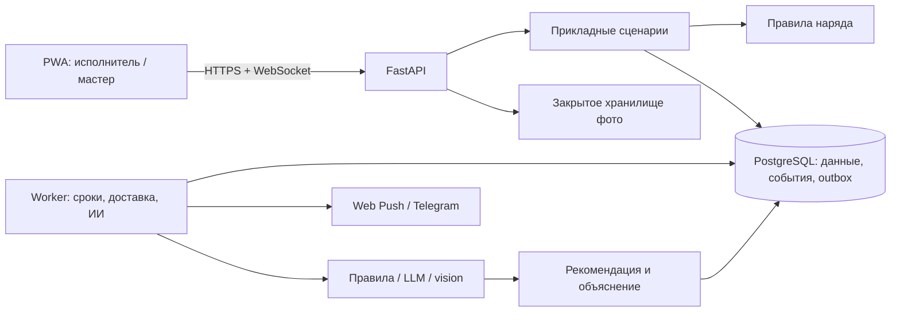
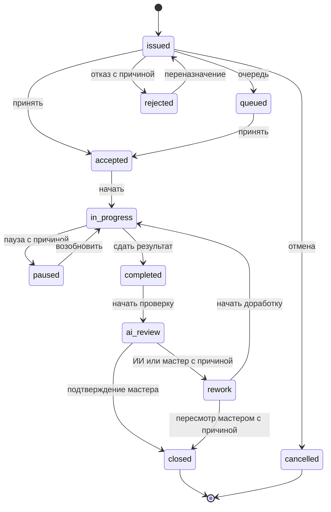

# Архитектура НарядAI

## Решение и текущее состояние

Модульный монолит: единая кодовая база backend, отдельный процесс worker, одна PostgreSQL.
Это позволяет проверять транзакции и быстро довести сквозной сценарий.
Микросервисы, orchestration-сервис и обучение собственной большой модели для кейса не нужны.

**Сейчас существуют:** domain, application, HTTP API авторизации/справочников/нарядов,
PostgreSQL, Alembic, аудит/outbox, приватное хранилище фото и seed.
Работает React PWA с API-клиентом, локальными снимками и очередью исполнителя.
Worker, WebSocket, push и реальный ИИ на схеме ниже — будущие этапы.

## Стек

| Слой | Решение | Состояние |
| --- | --- | --- |
| Runtime | Python 3.13.13, uv, uv.lock | Реализовано |
| HTTP | FastAPI, Pydantic Settings, Uvicorn | Сценарии и чтение нарядов реализованы |
| Данные | PostgreSQL 16.15, SQLAlchemy 2, psycopg, Alembic | Реализовано |
| Frontend | React 19.3 / TypeScript 6.0 / Vite 8.3, PWA; Node 24.21 | Реализовано; реальные телефоны — этап 8 |
| События | Транзакционный outbox в PostgreSQL | Запись готова; доставка/WebSocket — этап 5 |
| Фото | Приватные файлы, Pillow, авторизованная выдача | Реализовано; S3 — адаптер при внедрении |
| ИИ | Правила/статистика и отдельный адаптер LLM/vision | Этап 6 |
| Качество | pytest, coverage, Ruff, mypy, Actions | Локальные проверки; workflow подготовлен |

Python-зависимости закреплены в uv.lock, frontend — в frontend/package-lock.json,
Node — в .node-version. Непроверенный ИИ-провайдер не объявляется настроенным.

## Ответственность модулей

- domain: состояния, действия и инварианты; без веб-фреймворка/БД/сети.
- application: сценарии, объектные права, транзакции и идемпотентность.
- infrastructure: async SQLAlchemy/psycopg, модели, пул и приватное файловое хранилище; доставка/провайдеры — далее.
- api: HTTP-контракты справочников, auth, нарядов и фото; преобразование ошибок.
- auth: Argon2id, непрозрачные сессии, DB-лимиты входа и области доступа.
- demo: детерминированные записи и отдельные контрольные метки; явный seed пустой БД.
- Worker пользуется теми же прикладными правилами. Его системная роль недоступна через API.

Доменные ограничения ролей **не заменяют авторизацию**. Назначение исполнителя и доступ
мастера к участку проверяются приложением в транзакции изменения наряда.

## Модель данных

| Сущность | Назначение / инвариант |
| --- | --- |
| Участок | Уникальное обозначение и область доступа |
| Оборудование | Инвентарный номер, участок, тип, критичность |
| Сотрудник | Роль, специальность, разряд, бригада, смена; хеш секрета отдельно |
| Наряд | Номер, мастер, оборудование/участок, назначение, тип, приоритет, срок, status/version |
| Событие | Автор, действие, UTC-время, причина, исходный/целевой статус, версия |
| Фото | Наряд, до/после, storage key, автор, время загрузки/съёмки, hashes, размер |
| Списание | Материал, положительный Decimal, единица из справочника |
| Оценка ИИ | Версия проверки/наряда, вердикт, балл, уверенность, причины, решение мастера |
| Справочники | Бригады, шифры, материалы, нормативы |
| Технические записи | Сессии, лимиты входа, seed_runs, outbox, ключи идемпотентности; доставка/простои — далее |

Занятость и просроченность выводятся из фактов, а не редактируются как независимые флаги.
Исполнение, ожидание, реакция и простой — разные метрики. Пауза человека не прекращает
простой машины. Пересекающиеся интервалы простоя одной машины не суммируются дважды.

## Жизненный цикл

Основные десять статусов К §4 (с.3):
issued, accepted, queued, rejected, in_progress, paused, completed, ai_review, rework, closed.
cancelled добавлен для отмены из §5.1.

Показан основной путь; административные переходы определены в таблице домена и тестах.
Переназначение возвращает к выдаче; отмена/отказ/пауза требуют причины.
Терминальные состояния неизменяемы. Завершение работы не равно окончательному закрытию.

Просрочка активного наряда: now > deadline; на самой границе просрочки нет.
После completed таймер исполнения останавливается, после rework снова применяется срок.
Своевременность в отчётах вычисляется по истории сдачи, не только по текущему состоянию.

ИИ не закрывает наряд за человека. Мастер может пересмотреть отрицательный/сомнительный
результат с объяснением. Он также может вернуть работу на доработку вопреки положительному или неуверенному мнению ИИ. Исходная оценка сохраняется; повторная сдача создаёт новую версию.

## PostgreSQL и авторизация (реализовано на этапе 2)

Начальная миграция создаёт 16 таблиц приложения; `0002_order_workflow` добавляет ещё две
для outbox и идемпотентности, версии сдач и попытки ремонта. Внешние ключи запрещают осиротевшие записи,
составной FK связывает наряд с участком оборудования; CHECK проверяют диапазоны и порядок времён.
SQLAlchemy Enum сохраняет lowercase-значения домена с явными ограничениями.
Alembic upgrade/downgrade проверяются в изолированных тестовых схемах; metadata drift запрещён.
Readiness требует соединение и точную текущую revision; миграции применяются отдельной командой.

Database живёт в lifespan API; сессия/транзакция создаётся на запрос или сценарий.
Пул ограничен, заданы UTC и connect/statement/lock/idle timeout; настройки соединения
фиксируются commit и сохраняются после rollback. Соединения освобождаются при остановке.
Тесты запускаются только в БД с суффиксом _test, каждому выделяется случайная схема.

Секреты хешируются Argon2id. Случайный токен с 256 битами энтропии возвращается один раз;
БД хранит SHA-256 отпечаток, срок и отзыв. Каждое обращение проверяет активность сотрудника,
сессию и текущие участки. Админ управляет справочниками; executor не получает список сотрудников.
Попытки входа сериализуются row locks сначала по peer, затем по логину; отказ тоже commit.
Argon2 выполняется вне event loop с ограничением параллельности.
Смена секрета/роли/доступа блокирует ту же запись сотрудника и отзывает все его сессии.

Seed работает одной транзакцией под advisory lock, только в пустой non-production БД.
Повтор идентичной конфигурации не меняет данные/секреты и возвращает фактические количества.
Синтетические оценки имеют fixture-маркер; фотографий нет.
Мастер и руководитель читают наряды доступных участков; исполнитель — только свои.
Меняет назначение и принимает результат только мастер, выдавший наряд. Админ справочников
не читает ремонтные данные автоматически. Несуществующий и чужой объект дают одинаковый 404.

## Транзакции нарядов (реализовано на этапе 3)

- Время сервера в UTC с timezone, смены/интерфейс — Asia/Almaty. Наивные datetime запрещены.
  Часы подставляются в тестах.
- expected_version предотвращает потерю изменений. Повтор Idempotency-Key возвращает
  прежний результат; другой payload с тем же ключом даёт конфликт.
- Наряд, событие, outbox и запись идемпотентности сохраняются одной транзакцией.
- `FOR UPDATE` сериализует изменение наряда; блокировка сотрудника и частичный уникальный
  индекс не допускают двух `in_progress` у одного исполнителя. Пауза освобождает его для другой работы.
- Advisory lock сериализует ключи по автору; отпечаток учитывает операцию, ресурс и payload.
  При повторе снова проверяется текущая видимость наряда.
- DB-триггер запрещает UPDATE/DELETE событий. События содержат версию, попытку и снимок изменения.
  Чтение карточки и списка использует согласованный snapshot PostgreSQL.
- Каждая сдача имеет `submission_version`; доработка/переназначение меняют попытку.
  Материалы повторной сдачи — дополнительный расход; предыдущие строки сохраняются.
  Старая проверка не применяется к новой сдаче.
- Повтор мобильного действия не списывает материалы дважды.

**Этап 5, пока не реализовано:** worker с lease, повторами/backoff и дедупликацией,
восстановление задач из outbox после рестарта. WebSocket будет авторизован и отфильтрован
по доступу; reconnect должен загружать актуальный снимок.

Прототип рассчитан на одну API-инстанцию. Масштабирование требует общего канала уведомлений,
например PostgreSQL LISTEN/NOTIFY, и отдельной проверки.

## PWA и локальное состояние (этап 4)

React отвечает за ролевые экраны, формы и доступность; HTTP-клиент — за авторизацию,
типизированные ответы и стабильные ключи повтора; отдельный модуль IndexedDB — за снимки
и доставку действий. Сервер остаётся единственным источником подтверждённого состояния.
API повторно проверяет роли, владельца, версию и допустимость перехода.

Токен, срок и подтверждённая сервером личность живут в sessionStorage текущей вкладки.
Пароль не сохраняется. IndexedDB разделяет данные по actor ID; снимки живут 8 часов.
После перезагрузки без сети показываются сохранённые данные с отметкой времени.
Выход, истечение сессии и 401 очищают локальные данные пользователя; запоздавший 401
предыдущей сессии не должен отзывать новую. Вкладка после закрытия требует нового входа.

Очередь сохраняет намерение до отправки и допускает одну ожидающую команду на наряд.
Повтор использует прежние ключ, тело и expected_version; параллельные синхронизации
сериализованы. 409 блокирует автоматические повторы и требует решения пользователя,
сетевая ошибка/5xx/429 сохраняет команду, 401 останавливает доставку.
Статусы в карточках не меняются оптимистически. Выдача и фото доступны при связи.
Их ключ повтора сохраняется по отпечатку сессии, маршрута и содержимого до однозначного ответа.

Service worker кэширует только версионированную публичную оболочку. API и фотографии
не попадают в Cache Storage; приватные фото загружаются авторизованно и показываются
через временные blob URL. Новый shell заменяет только кэши с префиксом приложения.
Локальный proxy сохраняет единый origin. HTTPS, CSP и реальная установка относятся к этапу 8.

## Фото и ИИ (этапы 3/6)

Реализованы проверка JPEG/PNG/WebP, соответствие MIME, лимиты байтов и пикселей,
запрет анимаций, поворот, удаление метаданных и сжатие в JPEG. Файлы имеют случайные
ключи; API не раскрывает путь. Запись/чтение запрещают symlink, каталоги имеют права 700, файлы 600.
После ошибки транзакции созданный файл удаляется; аварийное завершение процесса между
записью файла и commit может оставить закрытый файл без DB-ссылки. Сверка/очистка
таких файлов и резервирование БД вместе с volume нужны при внедрении.
Сохраняется SHA-256 нормализованного JPEG; perceptual hash и детектор повторов — этап 6.
Сервер знает время загрузки;
EXIF/время клиента — недоверенные признаки. Нет EXIF — не доказательство подделки,
свежий EXIF — не доказательство свежей съёмки. Геометки не уходят во внешний ИИ.

Внутренний сервис уже сохраняет вердикт, балл, объяснение, модель, версию сдачи и флаг
ручной проверки, но генератор оценок/ИИ не подключён. У него нет публичного HTTP-маршрута.
Этап 6 добавит источники и развёрнутое объяснение проверки.
Правила будут проверять полноту/нормы, LLM/vision — смысл/видимые дефекты.
Реальный режим явно указан; fallback нельзя выдавать за вызов модели.
Изображение не доказывает безопасность оборудования. Сбой/низкая уверенность сохраняют
вопрос для мастера, не подтверждают качество автоматически.

Модель получает псевдонимы и минимальный контекст, без ФИО/контактов.
Тексты нарядов и ответы модели — данные: они не изменяют права и не запускают команды.

## Доступ и эксплуатация

Сейчас работают хеширование PIN/паролей, лимиты попыток, отзыв сессий, объектные права
нарядов/фото и ограничение загрузок. Дальше — отчёты и HTTPS при развёртывании. Руководитель не получает изменение ремонта,
а администратор справочников не становится мастером неявно.

Основа уже проверяет Host и конфигурацию; CORS закрыт по умолчанию; production скрывает docs.
Ошибки 500 не содержат внутренних деталей, каждый запрос имеет серверный ID.
Журнал хранит шаблон маршрута без query/body; стандартный access log Uvicorn отключается
флагом --no-access-log из README. Производственное развёртывание потребует отдельного пилота.

Будущая интеграция ERP/1С — отдельный адаптер со стабильными внешними идентификаторами.
Она пока не реализована.
