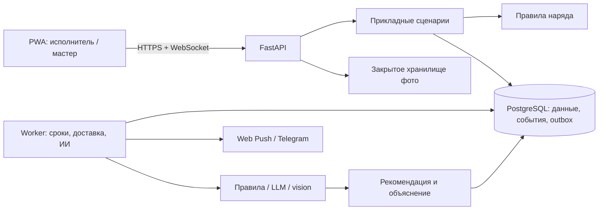
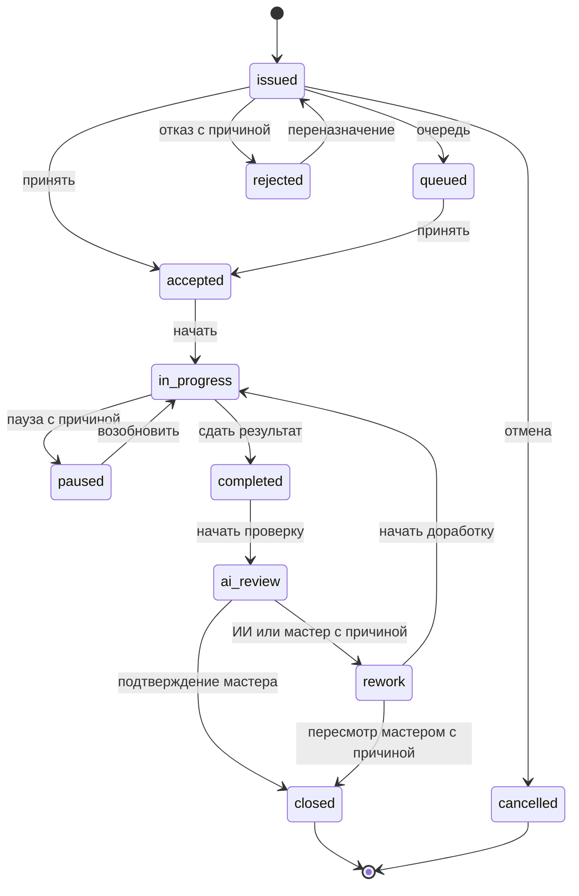

# Архитектура НарядAI

## Решение и текущее состояние

Модульный монолит: единая кодовая база backend, отдельный процесс worker, одна PostgreSQL.
Это позволяет проверять транзакции и быстро довести сквозной сценарий.
Микросервисы, orchestration-сервис и обучение собственной большой модели для кейса не нужны.

**Сейчас существуют:** domain, HTTP API справочников/авторизации, PostgreSQL, Alembic, seed, настройки и журнал запросов.
Остальная схема — целевая архитектура будущих этапов.

## Стек

| Слой | Решение | Состояние |
| --- | --- | --- |
| Runtime | Python 3.13.13, uv, uv.lock | Реализовано |
| HTTP | FastAPI, Pydantic Settings, Uvicorn | Основа |
| Данные | PostgreSQL 16.15, SQLAlchemy 2, psycopg, Alembic | Реализовано |
| Frontend | React + TypeScript + Vite, PWA | Этап 4 |
| События | WebSocket с восстановлением; outbox в PostgreSQL | Этап 5 |
| Фото | Приватный volume в демо; адаптер S3 при внедрении | Этап 3 |
| ИИ | Правила/статистика и отдельный адаптер LLM/vision | Этап 6 |
| Качество | pytest, coverage, Ruff, mypy, Actions | Локальные проверки; workflow подготовлен |

Версии Python-зависимостей БД закреплены в uv.lock; frontend/ИИ получат версии при реализации.
Непроверенный провайдер не объявляется настроенным. Установленный Node 18 не выбирается
для нового frontend: совместимый поддерживаемый Node закрепляется на этапе 4.

## Ответственность модулей

- domain: состояния, действия и инварианты; без веб-фреймворка/БД/сети.
- application (этап 3): сценарии, объектные права, транзакции и идемпотентность.
- infrastructure: async SQLAlchemy/psycopg, модели и управление пулом; файлы/доставка/провайдеры — далее.
- api: HTTP-контракты справочников и auth, проверки доступа, преобразование ошибок.
- auth: Argon2id, непрозрачные сессии, DB-лимиты входа и области доступа.
- demo: детерминированные записи и отдельные контрольные метки; явный seed пустой БД.
- Worker пользуется теми же прикладными правилами. Его системная роль недоступна через API.

Доменные ограничения ролей **не заменяют авторизацию**. Назначение исполнителя и доступ
мастера к участку проверяются приложением в транзакции изменения наряда.

## Модель данных

| Сущность | Назначение / инвариант |
| --- | --- |
| Участок | Уникальное обозначение и область доступа |
| Оборудование | Инвентарный номер, участок, тип, критичность |
| Сотрудник | Роль, специальность, разряд, бригада, смена; хеш секрета отдельно |
| Наряд | Номер, мастер, оборудование/участок, назначение, тип, приоритет, срок, status/version |
| Событие | Автор, действие, UTC-время, причина, исходный/целевой статус, версия |
| Фото | Наряд, до/после, storage key, автор, время загрузки/съёмки, hashes, размер |
| Списание | Материал, положительный Decimal, единица из справочника |
| Оценка ИИ | Версия проверки/наряда, вердикт, балл, уверенность, причины, решение мастера |
| Справочники | Бригады, шифры, материалы, нормативы |
| Технические записи | Сессии, лимиты входа, seed_runs; outbox/доставки/идемпотентность/простои — будущие этапы |

Занятость и просроченность выводятся из фактов, а не редактируются как независимые флаги.
Исполнение, ожидание, реакция и простой — разные метрики. Пауза человека не прекращает
простой машины. Пересекающиеся интервалы простоя одной машины не суммируются дважды.

## Жизненный цикл

Основные десять статусов К §4 (с.3):
issued, accepted, queued, rejected, in_progress, paused, completed, ai_review, rework, closed.
cancelled добавлен для отмены из §5.1.

Показан основной путь; административные переходы определены в таблице домена и тестах.
Переназначение возвращает к выдаче; отмена/отказ/пауза требуют причины.
Терминальные состояния неизменяемы. Завершение работы не равно окончательному закрытию.

Просрочка активного наряда: now > deadline; на самой границе просрочки нет.
После completed таймер исполнения останавливается, после rework снова применяется срок.
Своевременность в отчётах вычисляется по истории сдачи, не только по текущему состоянию.

ИИ не закрывает наряд за человека. Мастер может пересмотреть отрицательный/сомнительный
результат с объяснением. Он также может вернуть работу на доработку вопреки положительному или неуверенному мнению ИИ. Исходная оценка сохраняется; повторная сдача создаёт новую версию.

## PostgreSQL и авторизация (реализовано на этапе 2)

Начальная миграция создаёт 16 таблиц приложения. Внешние ключи запрещают осиротевшие записи,
составной FK связывает наряд с участком оборудования; CHECK проверяют диапазоны и порядок времён.
SQLAlchemy Enum сохраняет lowercase-значения домена с явными ограничениями.
Alembic upgrade/downgrade проверяются в изолированных тестовых схемах; metadata drift запрещён.
Readiness требует соединение и точную текущую revision; миграции применяются отдельной командой.

Database живёт в lifespan API; сессия/транзакция создаётся на запрос или сценарий.
Пул ограничен, заданы connect/statement/lock/idle timeout; соединения освобождаются при остановке.
Тесты запускаются только в БД с суффиксом _test, каждому выделяется случайная схема.

Секреты хешируются Argon2id. Случайный токен с 256 битами энтропии возвращается один раз;
БД хранит SHA-256 отпечаток, срок и отзыв. Каждое обращение проверяет активность сотрудника,
сессию и текущие участки. Админ управляет справочниками; executor не получает список сотрудников.
Попытки входа сериализуются row locks сначала по peer, затем по логину; отказ тоже commit.
Argon2 выполняется вне event loop с ограничением параллельности.
Смена секрета/роли/доступа блокирует ту же запись сотрудника и отзывает все его сессии.

Seed работает одной транзакцией под advisory lock, только в пустой non-production БД.
Повтор идентичной конфигурации не меняет данные/секреты и возвращает фактические количества.
Синтетические оценки имеют fixture-маркер; фотографий нет.
Доступ к конкретным нарядам и транзакции их изменений реализуются на этапе 3.

## Транзакции нарядов и доставка (план этапов 3–5)

- Время сервера в UTC с timezone, смены/интерфейс — Asia/Almaty. Наивные datetime запрещены.
  Часы подставляются в тестах.
- expected_version предотвращает потерю изменений. Повтор Idempotency-Key возвращает
  прежний результат; другой payload с тем же ключом даёт конфликт.
- Наряд, событие и outbox сохраняются атомарно. Доставка начинается после commit.
- Worker использует блокировки/lease, ограниченные повторы/backoff и дедупликацию.
  После рестарта задания восстанавливаются из БД.
- Повтор мобильного действия не списывает материалы дважды.
- WebSocket авторизуется и фильтруется по доступу; reconnect загружает актуальный снимок.
- Прототип имеет одну API-инстанцию. Масштабирование требует общего канала уведомлений,
  например PostgreSQL LISTEN/NOTIFY, и отдельной проверки.

## Фото и ИИ (этапы 3/6)

Проверяются реальный формат, байты и число пикселей. Фото нормализуется и сжимается.
Хеши и perceptual hash помогают обнаружить повторы. Сервер знает время загрузки;
EXIF/время клиента — недоверенные признаки. Нет EXIF — не доказательство подделки,
свежий EXIF — не доказательство свежей съёмки. Геометки не уходят во внешний ИИ.

Оценка включает вердикт, балл, причины, уверенность, источники и флаг ручной проверки.
Правила проверяют полноту/нормы, LLM/vision — смысл/видимые дефекты.
Реальный режим явно указан; fallback нельзя выдавать за вызов модели.
Изображение не доказывает безопасность оборудования. Сбой/низкая уверенность сохраняют
вопрос для мастера, не подтверждают качество автоматически.

Модель получает псевдонимы и минимальный контекст, без ФИО/контактов.
Тексты нарядов и ответы модели — данные: они не изменяют права и не запускают команды.

## Доступ и эксплуатация

Сейчас работают хеширование PIN/паролей, лимиты попыток и отзыв сессий. Дальше — доступ ко всем
нарядам/фото/отчётам, HTTPS и лимиты загрузок. Руководитель не получает изменение ремонта,
а администратор справочников не становится мастером неявно.

Основа уже проверяет Host и конфигурацию; CORS закрыт по умолчанию; production скрывает docs.
Ошибки 500 не содержат внутренних деталей, каждый запрос имеет серверный ID.
Журнал хранит шаблон маршрута без query/body; стандартный access log Uvicorn отключается
флагом --no-access-log из README. Производственное развёртывание потребует отдельного пилота.

Будущая интеграция ERP/1С — отдельный адаптер со стабильными внешними идентификаторами.
Она пока не реализована.
